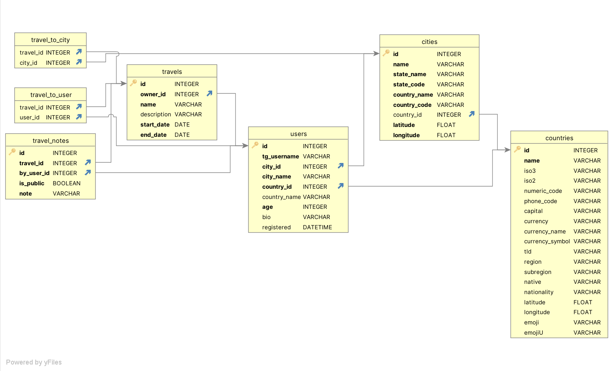

# [Travel agent](https://t.me/travel_agent_tg_bot): your best friend in travel planning #

## Start: ##
Everything is already prepared to be launched with Docker  
You simply need to edit env variables in Dockerfile and run
```bash
docker-compose up -d
```

You can your own bot token from [@BotFather](https://t.me/BotFather) and hotels API key on [Rapid API](https://rapidapi.com)  

You can use given database or create your own with similar scheme:



## Integrations and chosen technologies ##

### Telegram ###
Travel Bot runs on python-telegram-bot  
That library was chosen, as simple, yet powerful and convenient telegram API wrapper, supporting async programming  

### DB ###
As database, sqlite was chosen. It's file-base nature makes in convenient to deploy and 
work with SQLalchemy, which was chosen for creating ORM models as one of the best technologies for that purpose for Python.

### API ###
Bot uses staticmap library (which works with OpenStreetMap) for map rendering 
and [router.project-osrm.org](router.project-osrm.org) API with polyline library to create routes  
For weather forecast Travel Agent uses [Open Meteo](https://open-meteo.com) API  
For hotels: [Hotels com Provider](https://rapidapi.com/tipsters/api/hotels-com-provider)  

APIs were chosen for it's fully free use and open nature (or extensive free limit in case of Hotels com Provider)

## Usage ##
When you first start bot you have to sign up, by inputting some important for bot information  
Once, signed up, you can create your first travel (with '/new_travel' command). Or see '/my_travels'
if someone invited you  

From that point you can create more travels, see all your (and ones you invited to) travels ('/my_travels'),
get full information about the travel ('/travel_info') including route from your start location, weather
forecast and popular hotels (for each of travel locations).  
You can also edit your travels ('/edit_travel'), edit notes in your 
(and ones you invited to) travels ('/edit_notes') and leave travels you no longer take part in ('/leave_travel').
We hope you won't need that command, because it's always sad to cansel what you planed  

Travel notes may be public and private. As you guess other people can only see your public notes.
You can create in both your own travels and ones you invited to. Note, you can delete only notes, you created. 
You can manage your in travel purchases with '/travel_purchases'

Bot is featuring reply keyboard to make experience as streamlined as possible, so you want get lost on any step  
But in case you want to end any conversation you currently in just send '/stop'

That's all main information. Go ahead and start your first travel now!
